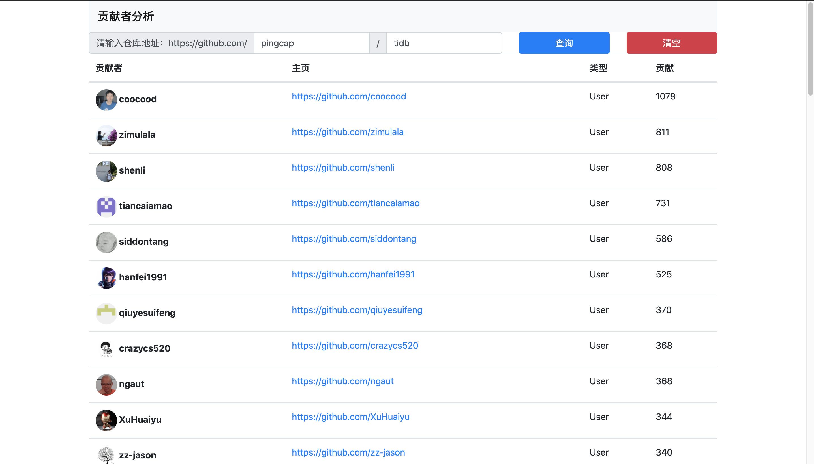

## 任务需求

独立运维部署一个网站，网站上呈现 https://github.com/pingcap/tidb repo的代码贡献者 github 列表，按 PR 个数体现


小作业考察点：
- 独立运维部署网站能力
- 使用 github 能力
- 前端技术
- 代码能力和风格
- 学习能力
- 团队协作能力（是否提供完备的注释文档）

## 项目展示



## 技术栈

前端BootStarp + Jquery 无后端支撑

## 运维部署

环境：CentOS 7.7 64位

```shell
# 安装nginx
sudo yum -y update
sudo yum install -y epel-release
sudo yum install -y nginx
# 设置nginx
sudo systemctl enable nginx
sudo systemctl start nginx

# 安装git
sudo yum -y install git

# 下载代码
cd /usr/share/nginx/html
git clone https://github.com/Eillot-wzx/GithubAnalysesSystem.git
```

演示站点: http://116.62.45.151/GithubAnalysesSystem/index.html